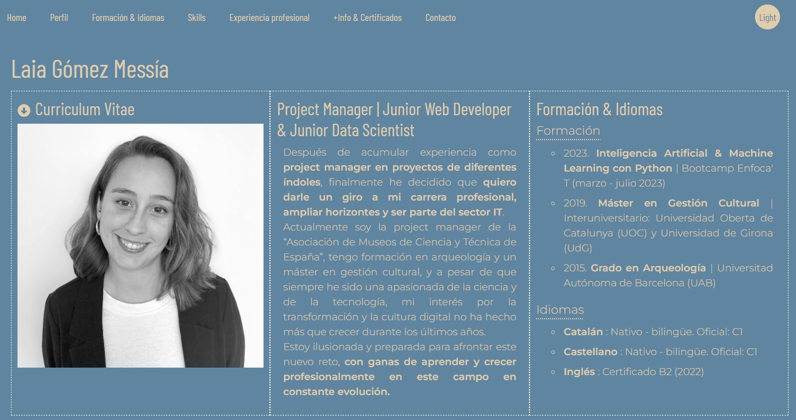

# project_cv

## Hi there! This is my first frontend project like web developer and it's about my cv

## Table of Contents
1. [General Info](#general-info)
2. [Screenshot](#screenshot)
3. [Technologies](#technologies)

***
### General Info

This is my first frontend project as a web developer, and it consists of a responsive webpage that serves as my curriculum vitae.
In addition to the HTML5 structure, CSS3 stylesheet, and JavaScript functions, I have made use of libraries such as Bootstrap and jQuery. I have also implemented a form, and one of the sections is dynamically generated from a JSON file. The webpage includes animations, and I have utilized icon and font libraries such as Font Awesome and Google Fonts.
Although there is room for improvement, and I hope to continue working on this project, I am currently satisfied with the results.

<!-- Este es mi primer proyecto de frontend como desarrolladora web y consiste en un una página web responsive que es mi curriculum vitae. 
Además de la estructura HTML5, la hoja de estiloc CSS3 y las funciones en JavaScript, he procurado usar librerias como Bootstrap y Jquery. También he implementado un formulario, uno de los apartados se crea dinámicamente a partir de un archivo json, tiene animaciones y he usado librarias de iconos y fuentes como Font Awesome y Google Fonts.
A pesar de que es mejorable y espero seguir trabajando en este proyecto, de momento estoy contenta con el resultado.  -->
***
### Screenshot

### Technologies
***
A list of technologies used within the project:

* [jQuery]: Version 3.2.1 Slim
* [Popper.js]: Version 1.12.9
* [Bootstrap]: Version 4.0.0
* [Font Awesome]: Version 6.4.0 / 4.7.0
* [Google Fonts]
In addition, the project includes the following custom scripts:
assets/js/main_cv.js
The technologies used in this project provide essential functionalities such as interactivity, responsive design, styling, icons, and fonts. jQuery and Popper.js are utilized for enhanced JavaScript functionality and Bootstrap is employed for building a responsive layout and UI components. Font Awesome and Google Fonts are used for adding icons and custom fonts to the project.
***